# Implementation check (generated)

Made by `apps/desktop/tests/e2e/visual.spec.ts` (`npm run e2e`). Each picture shows three
parts, from left to right: the reference, the app after its motion has settled, and the
difference in red. The reference is the locked design, except Home (L07), which is the end
frame of the H3 "You are here" motion mockup (picked 2026-11-14), and Paused (L10), the update
screens (U1, U3) and the file sync parts (F1 to F3), which are pictures of the app
(`tests/e2e/baselines`) because no design shows them in the H3 layout. Home (L07) and Settings
(L09) hide the file sync parts when they are compared with the design.
The QR code is hidden in both (the design has a fixed picture, the app draws the real code).
Limit: 1% of pixels.

| Screen | File | Reference | Different pixels | Picture |
|---|---|---|---|---|
| L01 | L01-welcome | locked design | 0.06% | 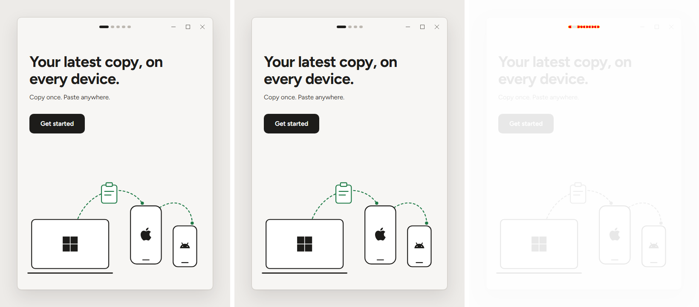 |
| L02 | L02-permissions | locked design | 0.93% | 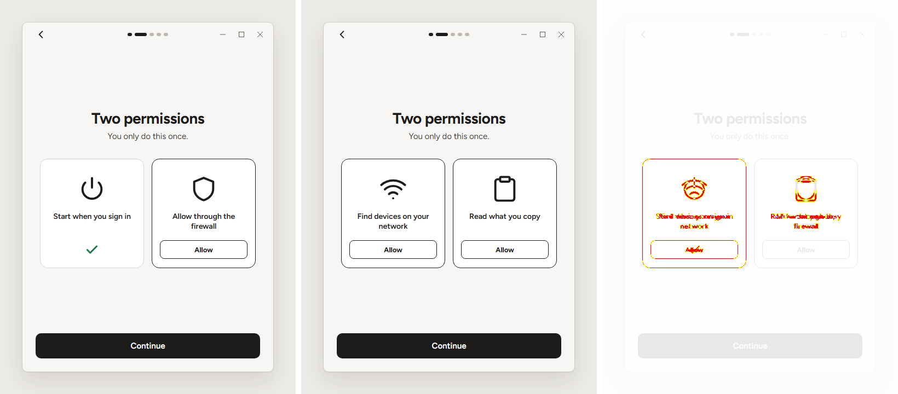 |
| L03 | L03-add | locked design | 0.06% |  |
| L04 | L04-show-code | locked design | 0.06% |  |
| L05 | L05-enter-code | locked design | 0.06% |  |
| L06 | L06-connected | locked design | 0.06% | 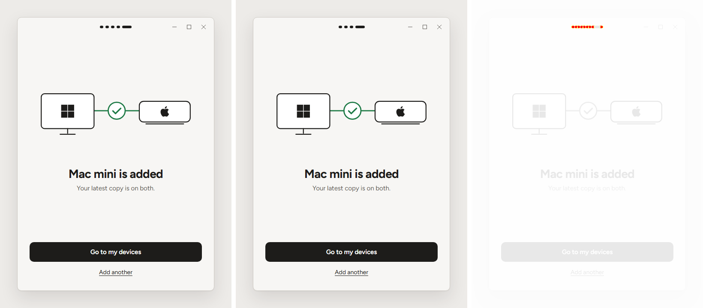 |
| L07 | L07-home | H3 mockup end frame (file buttons hidden) | 0.27% |  |
| L08 | L08-device | locked design | 0.00% | 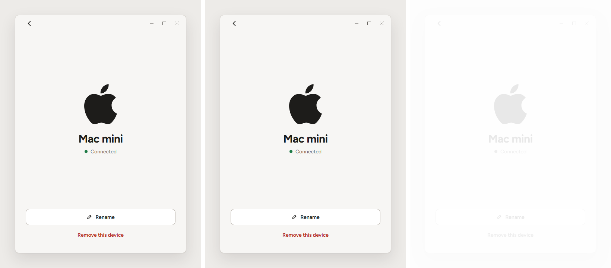 |
| L09 | L09-settings | locked design | 0.00% |  |
| L10 | L10-paused | app baseline (H3 layout, paused) | 0.00% |  |
| L11 | L11-attention | locked design | 0.00% |  |
| L12 | L12-other-network | locked design | 0.00% |  |
| U1 | U1-ready | app baseline (U1 ready) | 0.00% | 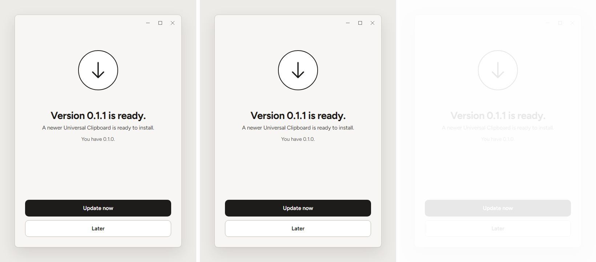 |
| U1 | U1-updating | app baseline (U1 updating) | 0.00% | 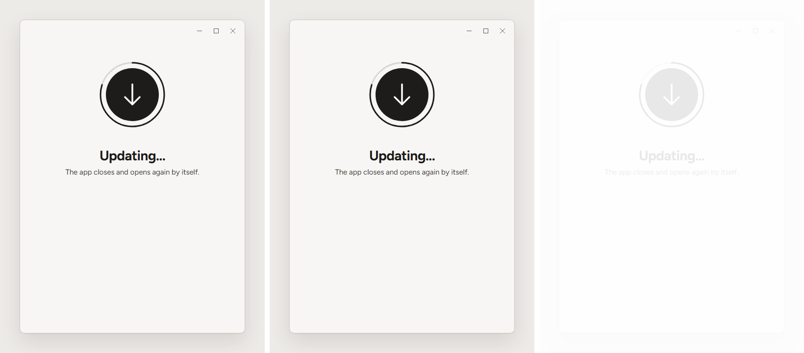 |
| U1 | U1-updated | app baseline (U1 updated) | 0.00% | 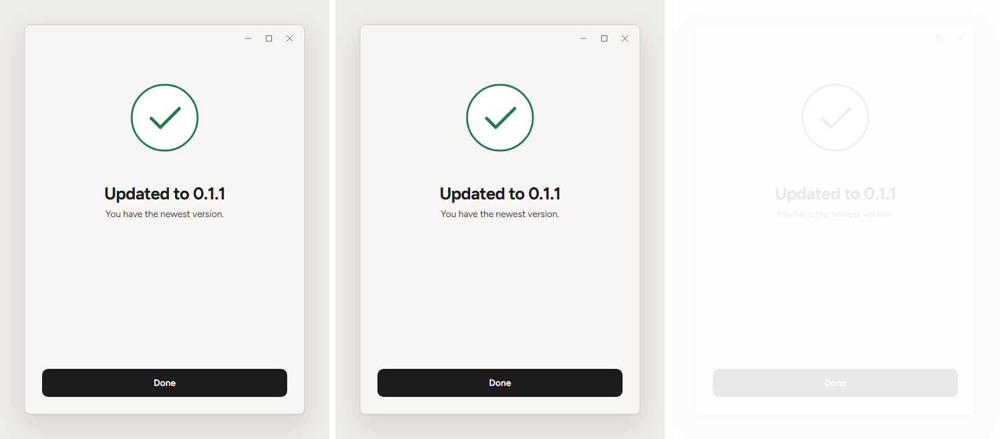 |
| U1 | U1-failed | app baseline (U1 failed) | 0.00% | 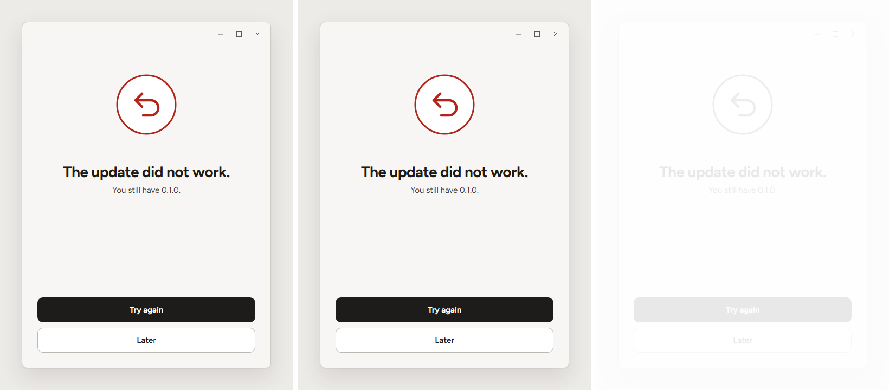 |
| U3 | U3-card | app baseline (U3 card on H3 Home) | 0.00% | 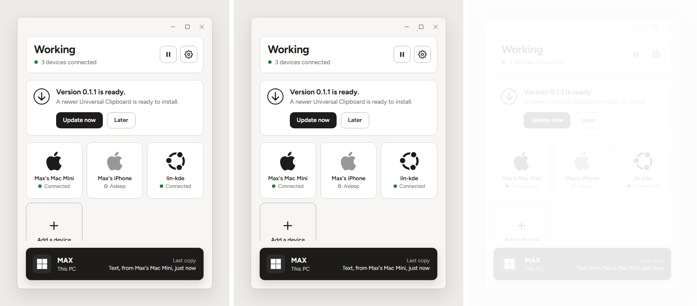 |
| U3 | U3-card-failed | app baseline (U3 card, failed) | 0.00% | 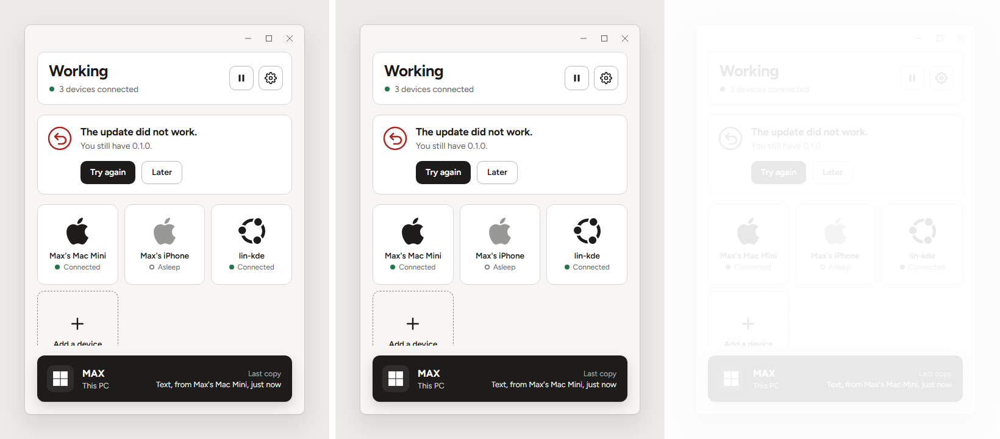 |
| F1 | F1-home-files | app baseline (Home with Copy files and Copy folder) | 0.00% | 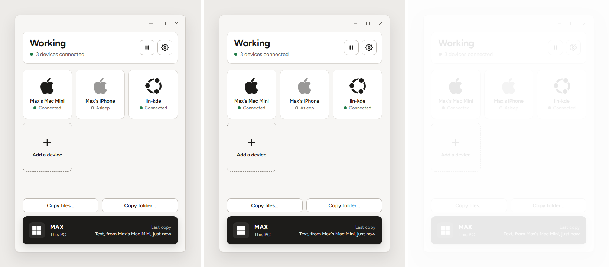 |
| F2 | F2-transfer | app baseline (progress line with Stop) | 0.00% | 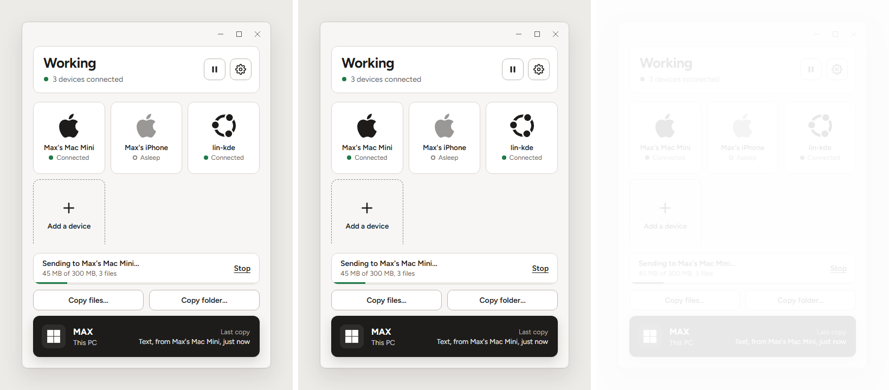 |
| F3 | F3-settings-files | app baseline (Sync files rows) | 0.00% | 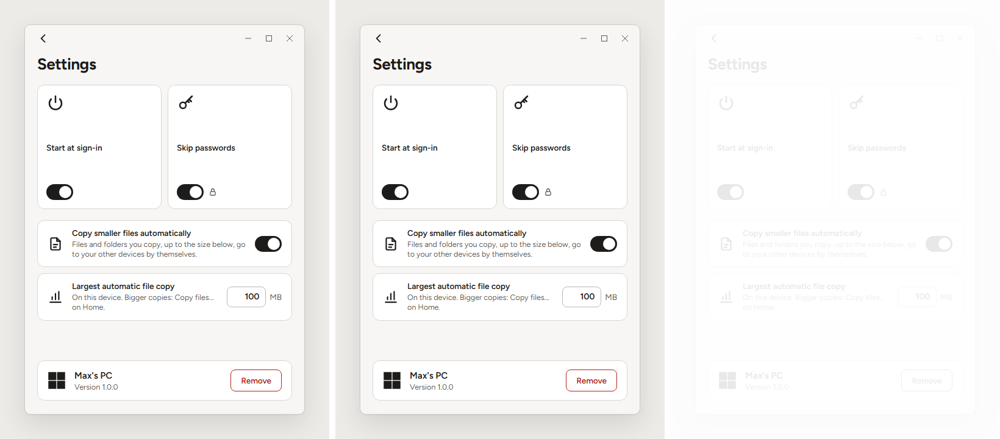 |
